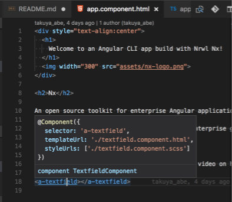

# Fast Retailing Supplier Portal Frontend App

This project was generated with [Angular CLI](https://github.com/angular/angular-cli) version 1.4.9.

## setup

```
$ npm i @angular/cli -g #if not installed angular-cli
$ cd path/to/this/repo
$ yarn #install dependencies
```

## Dev server

### Run dev-servers of all of SPL apps

```
$ cd path/to/this/repo
$ yarn start
```

Then, open links below

- http://localhost:4200
- http://localhost:4201
- http://localhost:4300
- http://localhost:4301
- http://localhost:4400
- http://localhost:4401
- http://localhost:4901

### Run each apps separately

```
$ cd path/to/this/repo
$ yarn dev-<appName> #e.g. dev-frmd
```

For other `dev-` commands, please refer `package.json`

## Editor Env.

Use [VSCode](https://code.visualstudio.com/)


### VSCode Plugins

> imported from `03. Development Arch - Ariake2.pdf`


Plugin | URL
--- | ---
TSLint Plugin | [https://marketplace.visualstudio.com/items?itemName=eg2.tslint](https://marketplace.visualstudio.com/items?itemName=eg2.tslint)
Angular5 TypeScript Code Snippets | [https://marketplace.visualstudio.com/items?itemName=johnpapa.Angular2](https://marketplace.visualstudio.com/items?itemName=johnpapa.Angular2)
Auto make JSDoc Plugin | [https://marketplace.visualstudio.com/items?itemName=joelday.docthis](https://marketplace.visualstudio.com/items?itemName=joelday.docthis)
SCSS Linter | [https://marketplace.visualstudio.com/items?itemName=adamwalzer.scss-lint](https://marketplace.visualstudio.com/items?itemName=adamwalzer.scss-lint)
Chrome Debugger | [https://marketplace.visualstudio.com/items?itemName=msjsdiag.debugger-for-chrome](https://marketplace.visualstudio.com/items?itemName=msjsdiag.debugger-for-chrome)
Editorconfig sync plugin | [https://marketplace.visualstudio.com/items?itemName=EditorConfig.EditorConfig](https://marketplace.visualstudio.com/items?itemName=EditorConfig.EditorConfig)
SCSS IntelliSense | [https://marketplace.visualstudio.com/items?itemName=mrmlnc.vscode-scss](https://marketplace.visualstudio.com/items?itemName=mrmlnc.vscode-scss)
Javascript/Typescript/SCSS/Json formatter | [https://marketplace.visualstudio.com/items?itemName=esbenp.prettier-vscode](https://marketplace.visualstudio.com/items?itemName=esbenp.prettier-vscode)

In addition to Ariake/青領域's suggested plugin, we also use plugins below.

```
Angular Language Service (see https://angular.io/guide/language-service)
https://marketplace.visualstudio.com/items?itemName=Angular.ng-template
```

The Angular Language Service is a way to get completions, errors, hints, and navigation inside your Angular templates whether they are external in an HTML file or embedded in annotations/decorators in a string.  
e.g. ⌘+mousehover => preview definition, ⌘+click => jump to definition


## Browser Env.
- Use Chrome
- Install Augury https://augury.angular.io/
- Install redux-devtool https://chrome.google.com/webstore/detail/redux-devtools/lmhkpmbekcpmknklioeibfkpmmfibljd

## Code scaffolding

Run `ng generate component component-name` to generate a new component. You can also use `ng generate directive|pipe|service|class|guard|interface|enum|module`.

### Generate atomic components

`ng g c atoms/checkbox2 --prefix a --export true --app spl-components`
`ng g c molecules/formblock --prefix m --export true --app spl-components`
`ng g c organisms/menu --prefix o --export true --app spl-components`
`ng g c molecules/formblock --prefix a --export true --app spl-components`

### Generate new endpoints

`ng generate app appName`


## Generate project documentation

This project use [**compodoc**](https://compodoc.github.io/website/) to generating project documentation

- To generate project document, run `yarn gen-doc`.

     The generated project documentation will be stored in the `documentation/` 

- When you're developing (running `yarn start`), you can view project documentation at [http://localhost:4200/doc/](http://localhost:4200/doc/) or [http://localhost:4201/](http://localhost:4201/).

     This documentation are keep updated when source code change.


- For how to write JSDoc, please refer 
     - [https://compodoc.github.io/website/guides/comments.html](https://compodoc.github.io/website/guides/comments.html)
     - [http://usejsdoc.org/about-getting-started.html](http://usejsdoc.org/about-getting-started.html)

## Build

Run `yarn build` to build the project. The build artifacts will be stored in the `dist/` directory.
This command will build all of the SPL apps. When you want to build each apps separately, please run `yarn build-<appName>`. See package.json for more detail of the commands.

## Static Server

Run `yarn server` to serve builded files & check them on `http://localhost:5555/<appName>` (e.g. `http://localhost:5555/frmd`).

## Running unit tests

Run `ng test` to execute the unit tests via [Karma](https://karma-runner.github.io).

## Running end-to-end tests

Run `ng e2e` to execute the end-to-end tests via [Protractor](http://www.protractortest.org/).

## Further help

To get more help on the Angular CLI use `ng help` or go check out the [Angular CLI README](https://github.com/angular/angular-cli/blob/master/README.md).


## State managament 

This project use **`ngrx/store`** to manage application state. `ngrx/store` is `RxJS` powered state management for Angular applications, inspired by `Redux`.

So firstly, we will need gain basic knowledge about `Redux`, `RxJS`, and then try some example like counter, router, ansync data, etc...

1. #### Redux
- To know what is **Redux**, take a look at **Redux** offical [page](http://redux.js.org/)
- Then you can build a minimal Redux in TypeScript by yourself with help from this [blog](http://blog.ng-book.com/introduction-to-redux-with-typescript-and-angular-2/)
- Dan Abramov, author of Redux, has a amazing talk [Hot Reloading with Time Travel](https://www.youtube.com/watch?v=xsSnOQynTHs). So let take a look too =_=


2. #### Reactive Programming
Reactive programming is programming with asynchronous data streams. Like  OOP guys say `Everything is object`, Reactive Programming have its own mantra `Everything is stream`.

     Bellow is some helpful resources

     - [Netflix JavaScript Talks - Async JavaScript with Reactive Extensions](https://www.youtube.com/watch?v=FAZJsxcykPs)
     -  [The introduction to Reactive Programming](https://gist.github.com/staltz/868e7e9bc2a7b8c1f754).

3. #### @ngrx: Reactive libraries for Angular
　A Comprehensive Introduction to @ngrx/store can be found [here](https://gist.github.com/btroncone/a6e4347326749f938510)

     `@ngrx` library contains:

     - [@ngrx/store](https://github.com/ngrx/platform/blob/master/docs/store/README.md): RxJS powered state management for Angular applications
     - [@ngrx/effects](https://github.com/ngrx/platform/blob/master/docs/effects/README.md): Side Effect model, modeling event sources as actions.
     - [@ngrx/router-store](https://github.com/ngrx/platform/blob/master/docs/router-store/README.md): Support working with `@angular/router`
     - [@ngrx/store-devtools](https://github.com/ngrx/platform/blob/master/docs/store-devtools/README.md): incorporate with [Redux DevTools Extension](http://extension.remotedev.io/), support a powerful time-travelling debugger.
